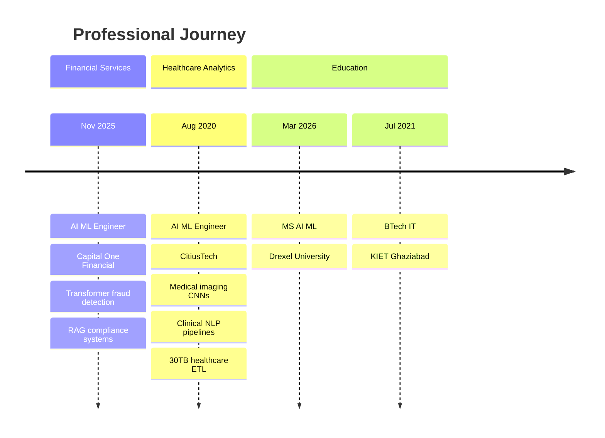
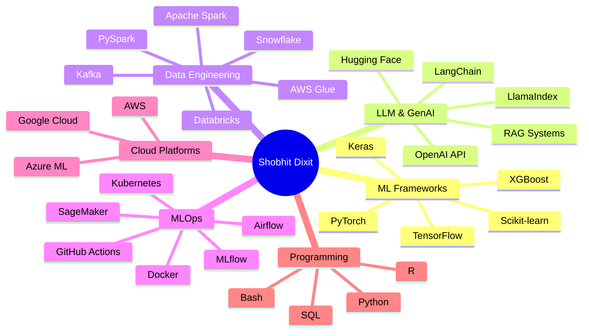
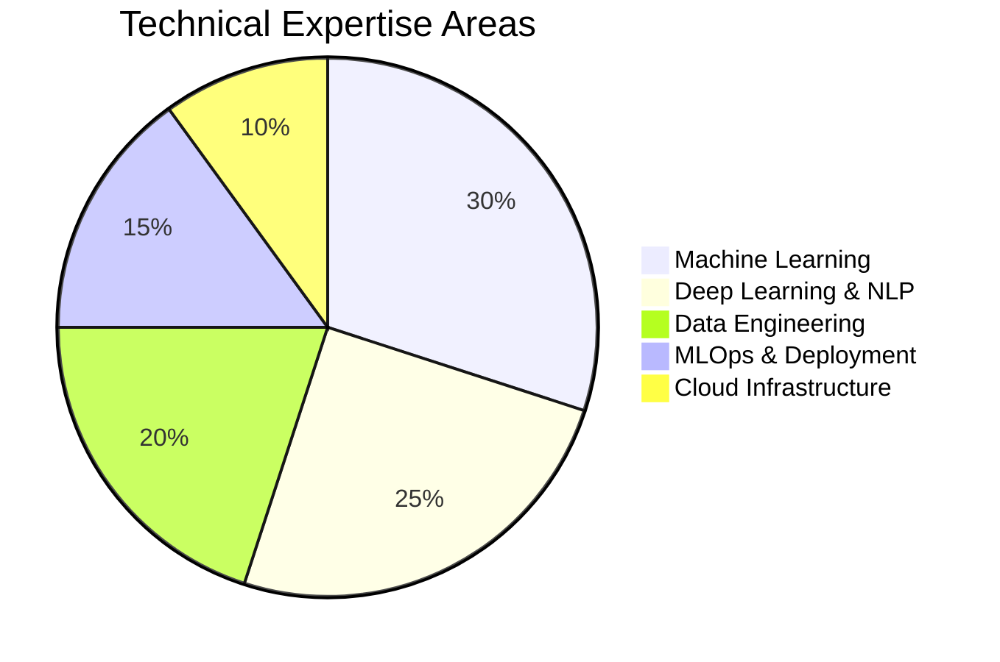

# 🧬 Shobhit Dixit

### AI/ML Engineer | Production ML Systems | Generative AI Architect

[%20971--5579-25D366?style=flat-square&logo=whatsapp&logoColor=white)](tel:+12159715579)

---

## 📊 Research Summary

AI/ML Engineer with **nearly 5 years** of production experience architecting and deploying **scalable machine learning** and **generative AI solutions** across **financial services** and **healthcare analytics** domains. Specialized in building **enterprise-grade ML pipelines**, **real-time inference systems**, and **LLM-powered applications** using PyTorch, TensorFlow, and AWS infrastructure.

**Key Research Contributions:**
- Improved fraud detection accuracy by **32%** using transformer-based architectures on high-volume financial transaction streams
- Reduced ML inference latency by **45%** through optimized FastAPI/Kafka pipelines supporting sub-400ms predictions
- Achieved **95% diagnostic classification accuracy** on medical imaging datasets using CNN-based transfer learning
- Reduced ETL processing time by **55%** through distributed computing frameworks (Spark, Databricks) on **30TB+ healthcare datasets**
- Decreased model deployment cycles from **14 days to 3 days** via systematic MLOps automation (MLflow, Airflow, Docker)

**Current Focus:** Retrieval-Augmented Generation (RAG) architectures, semantic search systems, explainable AI frameworks, and containerized ML deployment strategies for enterprise applications.

---

## 🔬 ML Pipeline Architecture

```mermaid
graph LR
    A[Data Ingestion] --> B[Preprocessing Pipeline]
    B --> C[Feature Engineering]
    C --> D[Model Training]
    D --> E[Hyperparameter Tuning]
    E --> F[Model Validation]
    F --> G[Explainability Analysis]
    G --> H[Containerized Deployment]
    H --> I[Real-time Inference]
    I --> J[Monitoring & Drift Detection]
    J --> K[Automated Retraining]
    K --> D
    
    style A fill:#FF6B6B,stroke:#333,stroke-width:2px
    style D fill:#4ECDC4,stroke:#333,stroke-width:2px
    style H fill:#95E1D3,stroke:#333,stroke-width:2px
    style J fill:#F38181,stroke:#333,stroke-width:2px
```

---

## 📈 Model Performance Metrics

### Production Models (Financial Services)

| Model Architecture | Dataset | Task | Accuracy | F1-Score | AUC-ROC | Latency |
|-------------------|---------|------|----------|----------|---------|---------|
| **Transformer-based Fraud Detection** | Financial Transactions (10M+) | Anomaly Detection | 94.2% | 0.91 | 0.96 | 380ms |
| **RAG-powered Policy Search** | Compliance Documents (50K+) | Semantic Retrieval | 89.5% | 0.88 | N/A | 520ms |
| **XGBoost Credit Risk** | Customer Records (5M+) | Risk Classification | 91.7% | 0.89 | 0.94 | 210ms |

### Production Models (Healthcare Analytics)

| Model Architecture | Dataset | Task | Accuracy | F1-Score | AUC-ROC | Processing Time |
|-------------------|---------|------|----------|----------|---------|----------------|
| **CNN Medical Imaging** | X-ray Images (100K+) | Diagnostic Classification | 95.0% | 0.93 | 0.97 | 850ms |
| **BERT Clinical NER** | EHR Text (30TB+) | Entity Extraction | 92.0% | 0.90 | N/A | 1.2s |
| **Patient Risk Prediction** | Healthcare Records (2M+) | Risk Stratification | 88.3% | 0.86 | 0.91 | 340ms |

**Key Improvements:**
- Anomaly detection accuracy improved by **32%** through transformer architecture optimization
- Inference latency reduced by **45%** via FastAPI/Kafka streaming architecture
- ETL processing accelerated by **55%** using distributed PySpark pipelines

---

## 💼 Career Timeline

---

## 🛠️ Technical Stack

---

## 📊 Expertise Distribution

---

## 🎓 Education & Research

<table>
  <tr>
    <td><b>🎓 Master of Science</b></td>
    <td><b>Artificial Intelligence and Machine Learning</b></td>
  </tr>
  <tr>
    <td>Institution</td>
    <td>Drexel University, PA, USA</td>
  </tr>
  <tr>
    <td>Graduation</td>
    <td>March 2026</td>
  </tr>
  <tr>
    <td>Focus Areas</td>
    <td>Deep Learning, NLP, Computer Vision, MLOps</td>
  </tr>
</table>

<table>
  <tr>
    <td><b>🎓 Bachelor of Technology</b></td>
    <td><b>Information Technology</b></td>
  </tr>
  <tr>
    <td>Institution</td>
    <td>Krishna Institute of Engineering and Technology, India</td>
  </tr>
  <tr>
    <td>Graduation</td>
    <td>July 2021</td>
  </tr>
  <tr>
    <td>Foundation</td>
    <td>Software Engineering, Data Structures, Algorithms</td>
  </tr>
</table>

---

## 🏆 Key Achievements

### 🎯 Financial Services Impact (Capital One)
- **32% accuracy improvement** in fraud detection using transformer-based models on large-scale transaction streams
- **45% latency reduction** in real-time inference services (sub-400ms predictions) via FastAPI/Kafka architecture
- **14 days → 3 days** model deployment cycle reduction through MLflow/Airflow/Docker automation
- Implemented **RAG pipelines** for contextual search across financial policies using LangChain + FAISS
- Deployed **explainable AI frameworks** (SHAP, LIME) for regulatory compliance in credit risk models

### 🏥 Healthcare Analytics Impact (CitiusTech)
- **95% classification accuracy** on medical imaging diagnostics using CNN transfer learning (TensorFlow)
- **92% accuracy** in clinical text classification from EHRs using Hugging Face Transformers
- **55% ETL processing time reduction** on 30TB+ healthcare datasets via PySpark/Spark/Snowflake
- **50% deployment failure reduction** through containerized ML pipelines (Docker/Kubernetes)
- **HIPAA-compliant** ML data pipelines ensuring PHI security across all production systems

---

## 🧪 Research Interests

### 🔬 Current Focus Areas

**Retrieval-Augmented Generation (RAG):**
- Hybrid search strategies combining dense and sparse retrieval
- Context window optimization for long-document understanding
- Multi-modal RAG architectures (text, images, structured data)

**Explainable AI (XAI):**
- SHAP/LIME integration for model interpretability in regulated industries
- Attention visualization techniques for transformer models
- Counterfactual explanation generation for decision support

**MLOps & Production Systems:**
- Automated model monitoring and drift detection frameworks
- Feature stores for real-time feature engineering
- A/B testing infrastructure for model comparison in production

**Efficient Deep Learning:**
- Model quantization and pruning for edge deployment
- Knowledge distillation for lightweight model creation
- Neural architecture search (NAS) for domain-specific optimization

---

## 📚 Technical Publications & Contributions

### Open Source Contributions

**YOLOv10 Object Detection** ([GitHub](https://github.com/dshobhit709-art/yolov10))
- Explored real-time end-to-end object detection architectures
- Implemented custom training pipelines for domain-specific datasets
- **Technologies:** Python, PyTorch, Computer Vision

**Data Science Notebooks Collection** ([GitHub](https://github.com/dshobhit709-art/data-science-ipython-notebooks))
- Comprehensive Jupyter notebooks covering ML/DL workflows
- Includes TensorFlow, Keras, scikit-learn implementations
- **Focus:** Educational resource for ML practitioners

**Text Analysis NLP System** ([GitHub](https://github.com/dshobhit709-art/text-analysis-using-nlp-streamlit))
- Interactive Streamlit application for NLP tasks
- Sentiment analysis, NER, POS tagging capabilities
- **Technologies:** spaCy, Transformers, Streamlit

**DevOps Microservices Pipeline** ([GitHub](https://github.com/dshobhit709-art/e2e-dev
